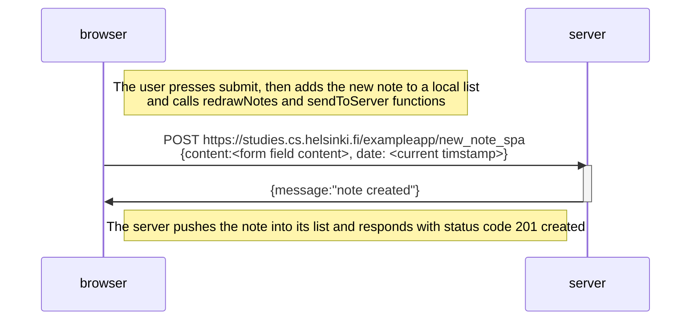

```mermaid
  sequenceDiagram
    participant browser
    participant server

  Note right of browser: The user presses submit, then adds the new note to a local list<br> and calls redrawNotes and sendToServer functions

  browser->>server: POST https://studies.cs.helsinki.fi/exampleapp/new_note_spa <br> {content:<form field content>, date: <current timstamp>}
    activate server
    server->>browser: {message:"note created"}
    deactivate server

  Note left of server: The server pushes the note into its list and responds with status code 201 created
```
