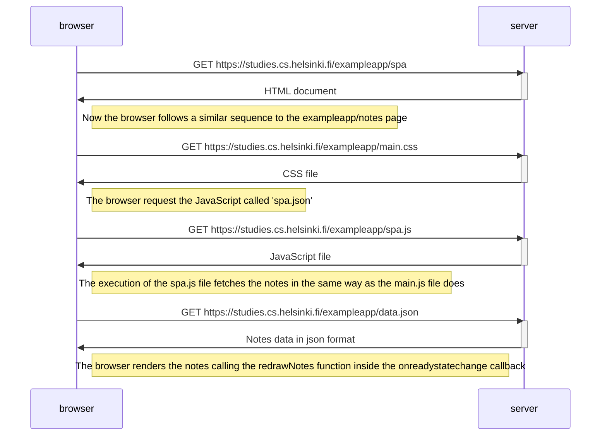

```mermaid
  sequenceDiagram
    participant browser
    participant server

    browser->>server: GET https://studies.cs.helsinki.fi/exampleapp/spa
    activate server
    server->>browser: HTML document
    deactivate server

    Note right of browser: Now the browser follows a similar sequence to the exampleapp/notes page
    browser->>server: GET https://studies.cs.helsinki.fi/exampleapp/main.css
    activate server
    server->>browser: CSS file
    deactivate server

    Note right of browser: The browser request the JavaScript called 'spa.json'
    browser->>server: GET https://studies.cs.helsinki.fi/exampleapp/spa.js
    activate server
    server->>browser: JavaScript file
    deactivate server

    Note right of browser: The execution of the spa.js file fetches the notes in the same way as the main.js file does
    browser->>server: GET https://studies.cs.helsinki.fi/exampleapp/data.json
    activate server
    server->>browser: Notes data in json format
    deactivate server

    Note right of browser: The browser renders the notes calling the redrawNotes function inside the onreadystatechange callback
```
